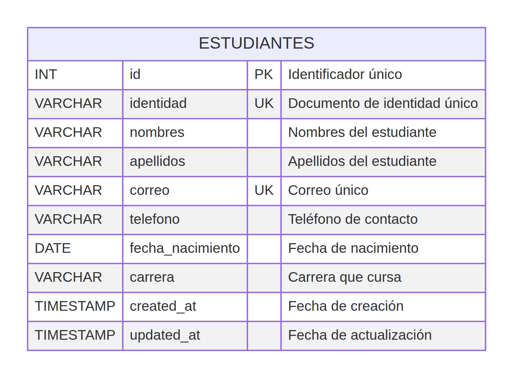

# Diagrama Entidad–Relación (DER)

## Sistema de Administración de Estudiantes

El modelo de datos se ha mantenido deliberadamente compacto porque el alcance del sistema solicita administrar registros de estudiantes. Por ello, la entidad **ESTUDIANTES** concentra los datos de identificación, contacto y carrera. La integridad se protege mediante una clave primaria autonumérica y restricciones de unicidad para la identidad y el correo electrónico.

| Atributo | Tipo de dato | Regla | Descripción |
|---|---|---|---|
| `id` | `INT UNSIGNED` | PK, autoincremental | Identificador técnico único del expediente. |
| `identidad` | `VARCHAR(15)` | UNIQUE, NOT NULL | Documento de identidad del estudiante. |
| `nombres` | `VARCHAR(100)` | NOT NULL | Nombres del estudiante. |
| `apellidos` | `VARCHAR(100)` | NOT NULL | Apellidos del estudiante. |
| `correo` | `VARCHAR(150)` | UNIQUE, NOT NULL | Correo electrónico de contacto. |
| `telefono` | `VARCHAR(20)` | NOT NULL | Número telefónico de contacto. |
| `fecha_nacimiento` | `DATE` | NOT NULL | Fecha de nacimiento. |
| `carrera` | `VARCHAR(120)` | NOT NULL | Carrera académica registrada. |
| `created_at` | `TIMESTAMP` | NOT NULL | Fecha y hora de creación del registro. |
| `updated_at` | `TIMESTAMP` | NOT NULL | Fecha y hora de la última actualización. |

> Las restricciones `UNIQUE` de `identidad` y `correo` evitan registrar dos expedientes con la misma información de identificación principal.

El archivo fuente editable del diagrama es [`DER.mmd`](DER.mmd).
